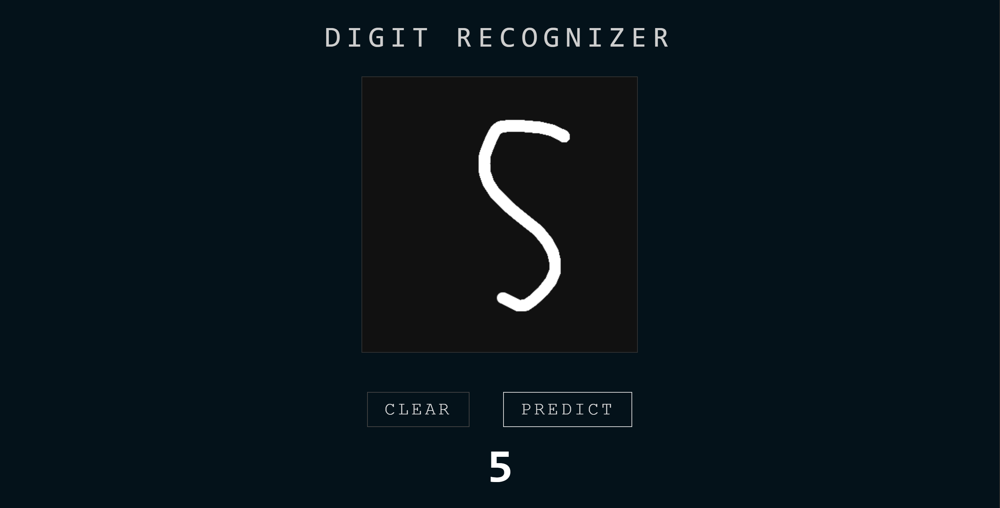
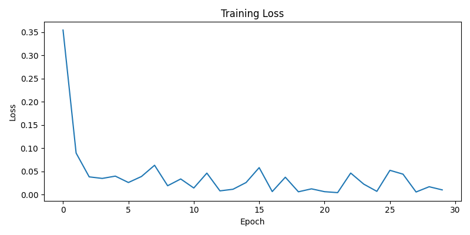
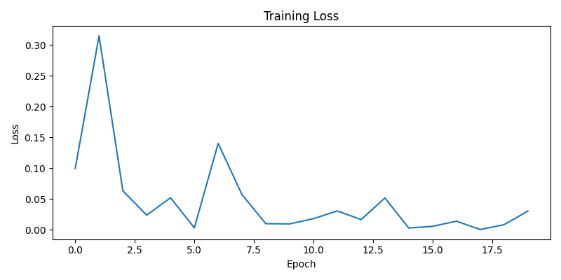

# Digit Recognition System

A handwritten digit recognition system built from scratch with NumPy. This project contains a custom implementation of both a fully connected neural network and a convolutional neural network.

## Live Demo
### [Demo Web App](https://codeaarav10-digit-recognizer.hf.space)



### How to Use
1. Draw any digit (0-9) on the canvas
2. Click **Predict** to see the prediction from both the CNN and the Neural Network
3. Click **Clear** to reset and try again

## Overview
This project explores handwritten digit recognition by implementing neural networks from first principles using NumPy.

The original version of the project used a three-layer fully connected neural network. The project has since been expanded to include a custom CNN implementation, including the core operations required to train a convolutional model.

No machine learning framework is used for the neural network itself. The forward pass, backpropagation, convolution, pooling, activation functions, loss computation, and parameter updates are implemented manually.

To improve performance on handwriting that differs from the clean MNIST training images, random data augmentation is applied during training. Images can be shifted, rotated, blurred, or contaminated with Gaussian noise.

The models are trained on the MNIST handwritten digit dataset, which contains 28×28 grayscale images belonging to 10 classes.

The trained model is served through a Flask web app where users draw a digit on a canvas, the image is preprocessed and passed through the network, and the predicted digit is returned in real time. The full pipeline (from raw pixel values to a prediction) runs in under a second.

The project also includes cross-validation to find optimal hyperparameters and a benchmarking script to visualize the training loss curve.

## Technical Highlights
- Neural networks implemented from scratch using NumPy
- Custom CNN implementation with manually implemented convolution and max pooling
- Manual forward and backward propagation
- Custom ReLU and Softmax activation functions
- Custom cross-entropy loss with manually implemented gradients
- He initialization for trainable layers
- Mini-batch gradient descent
- Hyperparameter tuning through cross-validation
- Early stopping during hyperparameter evaluation
- Random data augmentation during training
- Flask web interface with a drawing canvas
- Model weights saved and loaded using Python pickle
- No TensorFlow or PyTorch used for the neural network implementation__

## Dataset
The model is trained on [MNIST](http://yann.lecun.com/exdb/mnist/) — one of the most well-known datasets in machine learning. It contains 70,000 grayscale images of handwritten digits:
- 60,000 training images
- 10,000 test images
- Each image is 28x28 pixels, flattened to a vector of 784 values
- Pixel values are normalized from [0, 255] to [0, 1] before training

MNIST is automatically downloaded the first time you run `train.py` — no manual setup required.

## Neural Network
The original model is a fully connected neural network built entirely from scratch using NumPy. Forward propagation, backpropagation, loss calculation, and weight updates are implemented manually.

### Architecture
1. 784 Input
2. Dense (128) -> ReLU
3. Dense (64) -> ReLU
4. Dense (10) -> Softmax

### Training
- **Optimizer**: Mini-batch gradient descent
- **Loss**: Cross-entropy
- **Data**: MNIST
- **Data augmentation**: Random shifts, rotations, blur, and noise

### Cross-Validation
Hyperparameters such as learning rate, batch size, and epochs were evaluated to find an effective training configuration.

**Best Hyperparameters**: Learning Rate: 0.1, Batch Size: 32

### Results
- **Test Accuracy**: 98.36%
- Training: 30 epochs with data augmentation




## Convolutional Neural Network
The project was extended with a custom CNN, also implemented entirely from scratch using NumPy. The CNN preserves the spatial structure of the input image and learns local features through convolution and pooling.

### Architecture
1. 1 × 28 × 28 Input
Conv2D (8 filters, 3×3) -> ReLU
2. MaxPool2D (2×2)
3. Conv2D (16 filters, 3×3) -> ReLU
4. MaxPool2D (2×2)
5. Flatten
6. Dense (128) -> ReLU
7. Dense (10) -> Softmax

### Custom Implementation:
- Convolution and convolution backpropagation
- Max pooling and backpropagation
- Dense layers
- ReLU and Softmax
- Cross-entropy loss
- Forward and backward propagation
- Weight and bias updates

### Training
**Optimizer**: Mini-batch gradient descent
**Learning Rate**: 0.05
**Batch Size**: 32
**Epochs**: 20
**Loss**: Cross-entropy
The CNN was tested with multiple learning rates and batch sizes using a 90/10 training-validation split.

Early stopping was used during hyperparameter evaluation.

Best configuration:

Learning rate: 0.05
Batch size: 32
Validation accuracy: 98.98%

### Results
- **Test Accuracy**: 98.58%
- Training: 20 epochs with data augmentation



## Data Augmentation
To make the model robust to real-world handwriting, each training image is randomly augmented during training:
- **Random shift** — moves the digit up to 3 pixels in any direction
- **Random rotation** — rotates up to 15 degrees
- **Gaussian blur** — softens edges to simulate different pen pressures
- **Gaussian noise** — adds random pixel noise to prevent overfitting

Each augmentation is applied independently with 50% probability per image per epoch, meaning the model rarely sees the same image twice.

## How It Works
1. User draws a digit on a canvas
2. The image is sent to a Flask backend as a base64 string
3. The image is preprocessed — converted to grayscale, resized to 28x28, normalized to [0, 1]
4. The fully connected neural network and CNN make a prediction
5. The predictions are returned and displayed instantly

## Dependencies
| Library | Purpose |
|---|---|
| numpy | Neural network, forward/backward pass |
| Flask | Web backend |
| Pillow | Image preprocessing |
| scipy | Data augmentation |
| matplotlib | Loss curve plot |

## Setup

### 1. Clone the repository
```bash
git clone https://github.com/codeAarav10/digit_recognition_system
cd digit_recognition_system
```

### 2. Install dependencies
Install all required Python packages:
```bash
pip install -r requirements.txt
```

### 3. Train the neural network model
This downloads MNIST, trains the network for 30 epochs, and saves the weights to `neural_netowork/model/weights.pkl`:
```bash
python -m neural_network.train
```

### 4. Train the CNN model
This downloads MNIST, trains the network for 20 epochs, and saves the weights to `cnn/model/weights.pkl`:
```bash
python -m cnn.train
```

### 5. (Optional) Generate loss curve
Plots and saves the training loss curve to `assets/loss_curve.png` and `assets/loss_curve_cnn.png`:
```bash
python cnn/benchmark.py
python neural_network/benchmark.py
```

### 5. Run the app
Starts the Flask server locally at `http://127.0.0.1:5000`:
```bash
python app.py
```